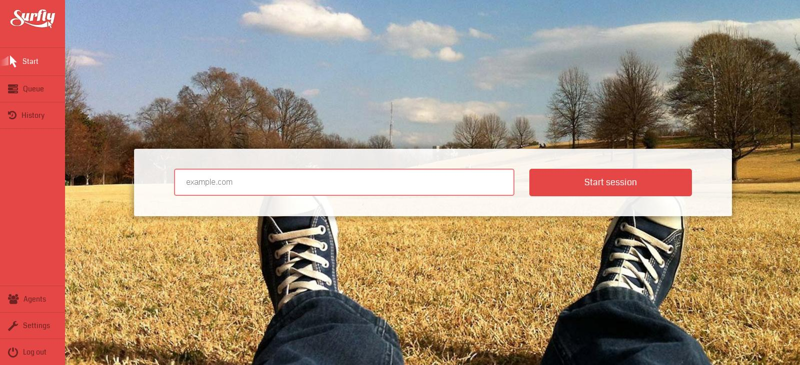

#The Surfly Tutorial

###Welcome to Surfly

Surfly's co-browsing technology enables you to share your browser with others. To start a Surfly session, enter the url of your chosen webpage into the 'start session' panel on your admin page. You can invite people to join you by sharing the session url with them. This is the easiest and quickest way to co-browse and doesn't require any configuration.

Alternatively, if you wish to use Surfly as a feature on your own website, you can add the Surfly widget code to your website. Adding this code already allows you to start co-browsing, and Surfly works without any alterations. Small additions to the code allow you to fully customize the appearance and behavior of the Surfly session. You can choose to use as much, or as little, of Surfly's functionality within your own product.

###The Tutorial

If you would like to learn more about Surfly, follow our step by step guide as we integrate Surfly into our example application. Major steps and changes are illustrated by an image/gif and, for each modification, you can refer to our repository, where you'll find a corresponding commit.

In this tutorial, we will highlight the main features on offer, and show you how you can make Surfly as visible, or as invisible, as you wish, depending on your needs and preferences.

| Please note: |
| ------------- | 
| If you wish to integrate Surfly, you need to give Surfly access to the server. This is especially important when you are developing locally.  | 

